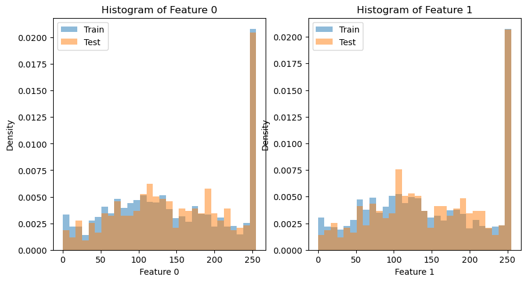

  

This is definitely my favorite project that I have ever completed; written entirely in Python and accompanied by an analysis paper that I wrote in LaTeX, it hinges entirely on taking images from a users desktop (fruits in this instance, although anything would work), converting them to grayscale, making their dimension divisible by eight and collecting data on every applicable pixel to place within a CSV file while appending the applicable class that it is numerically to the end of it - after that is facilitated, we can utilize different Machine Learning models to train from the CSV's and can achieve accuracies when the machine is testing to higher than 80%.  This program although only a few hundred lines long was the culmination of hundreds of pages read, dozens of algorithms understood, and seemingly countless hours of applying it, seeing the result and repeating.  I could honestly talk about this one project all day, but as aforementioned, I put it all within my PDF file alongside all of the input and output pictures and graphs for the project at the link at bottom of this page.  Just to maybe entice you, I will put a small blurb from that PDF below this: 

<pre>

XIII. REGRESSION BASED MODEL
Task 2 is to introduce a regression-based model in the
form of either lasso or elastic-net regression as a two-class
classifier. We then are supposed to form confusion matrices
using the responses for the predicted and actual labels and then
subsequently save them. To be fully transparent, I know that
the entire point of the first task was to call upon data domains
that we just saved (80/20), but throughout this entire task I
had a hard time with that so ultimately just reverted to the
normal pd.read. . . route and just copied what was done from
the task above into this section. Luckily for all us students,
most of the code I had to use for implementation of Lasso
was provided within the class file: ”class-code-lasso-reg.txt”.
Some of the small tweaks that I made include using ’label’
instead of nn for when creating X and y because I was getting
an error: could not convert string to float: feature_0 so
just .dropping label for X was infinitely easier than trying to
troubleshoot anything further. The other notable change that
I made was increasing the max iterations to 10000 - I did
this as I received an error in my console intermittently that
convergence was not being reached and to resolve that I could
simply raise iterations so I did and have stopped having issues.
The Math was already provided in Class Files so very little
issues there besides occasional errors about division, so I made
it an if statement to resolve that. Although I will say and you
will see from the console output, it is definitely wrong - but I
am just using what was provided.
  
</pre>

Source: <a href="https://github.com/lbbowles/Fruit-Identifying-Machine-Learning-Model-CSC-340">lbbowles/Fruit-Identifying-Machine-Learning-Model-CSC-340</a>
