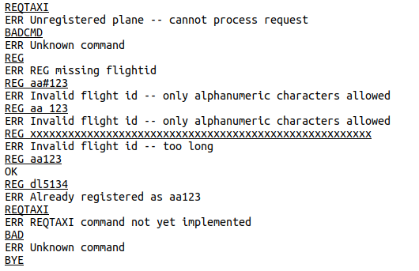

This is the oldest project featured on this webpage, but it's definitely a valuable one to have in my repertoire.   

The project was developed in a Linux environment via a Virtual Machine, allowing students to become comfortable working directly in the shell.  Moreover, It was also the first large-scale project I wrote in C, rather than C++ or Java.  The entire idea of the project was to utilize the C language to create a TCP-based server that handles airplane clients issuing structured protocol commands such as registering flight IDs, requesting taxi clearance, and coordinating takeoff. Each airplane functioned as a client, with its session managed in a separate thread. I used a thread-safe array list to store and manage client data.  Finally, safety measurements such as takeoff delays and queues were implemented.  Altogether, this project was a fun yet challenging introduction to systems-level programming and multithreading, it was definitely an experience that strengthened my foundation as an aspiring Software Engineer.

Below are a few excerpts written by the professor that highlight the objectives and difficulties / nuances of this project:

 
Source: <a href="https://github.com/lbbowles/Airplane-Controller-C-Project">lbbowles/Airplane-Controller-C-Project</a>
